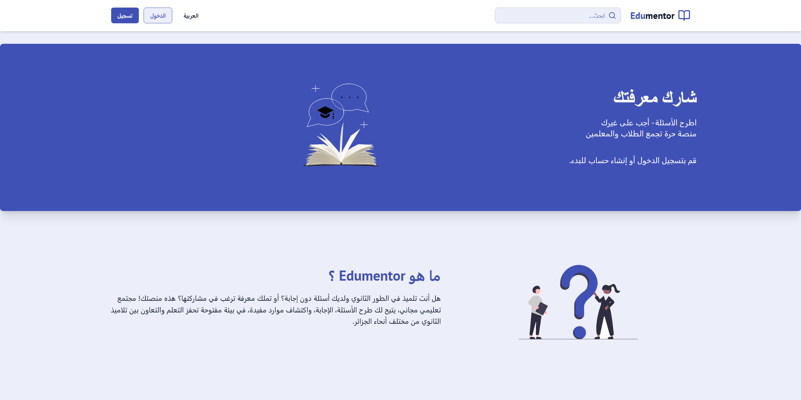
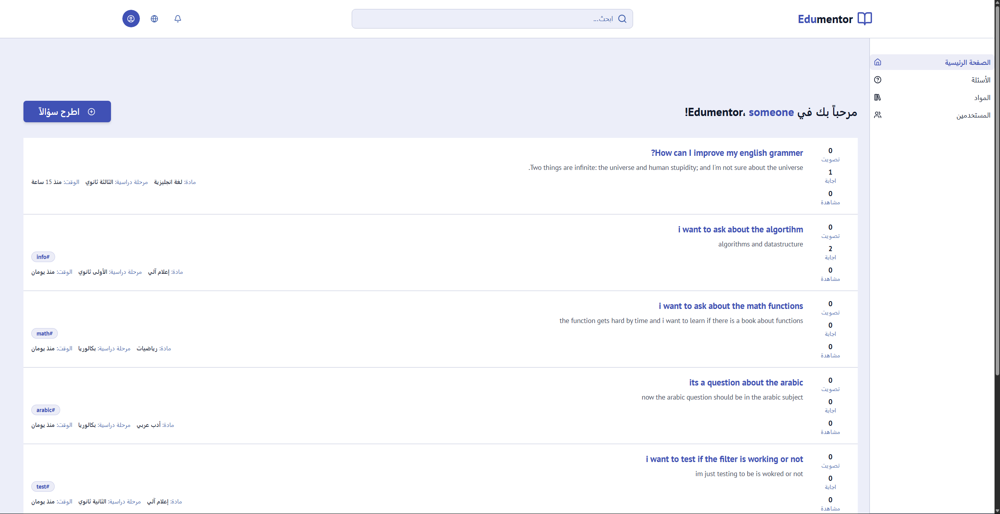
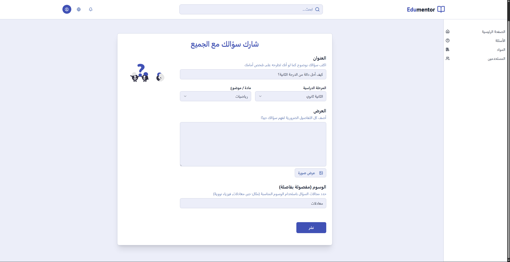
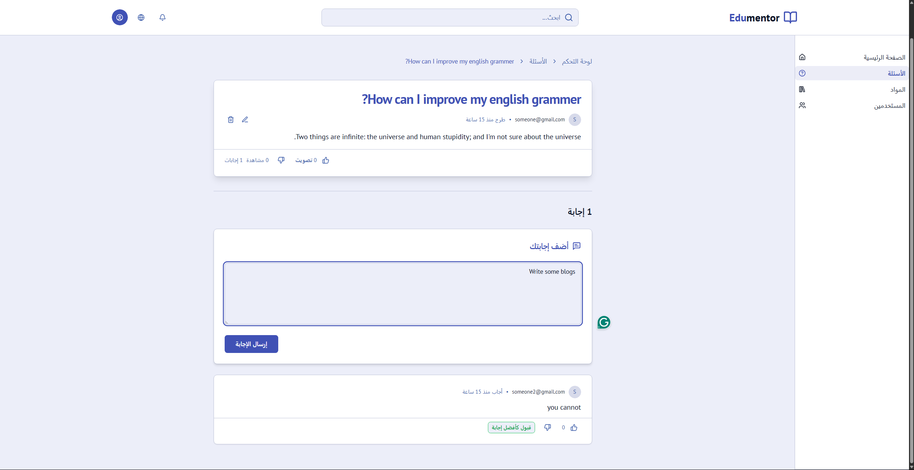

# Edumentor

Edumentor is a platform directed to students and teachers. It's a place where students can ask questions and teachers can answer them.

## ✨ Main Features

Below are some of the main features of the app.

### 🔹 Home page

Users will be presented with this beautiful home page, it will introduce them to the website where they can get a full understanding of the website.

---

### 🔹 Sign In

Users can sign in by creating a name and using their email & password, or can sign in with their Google account.

---

### 🔹Select user interests

Users can select their interests, which will be used to find answers to their questions.

---

### 🔹 Browse questions

Users can browse and read through questions and answers, upvoting and downvoting answers.

---

### 🔹 Ask Questions

Users can ask questions, selecting their subject and grade level, and add tags to their question.

---

### 🔹 Answer Questions

## Users can answer questions, and teachers can choose the right answer.

### 🔹 Searcg for Questions

Users can search for questions, apply filters such as subject, grade level, and tags.
